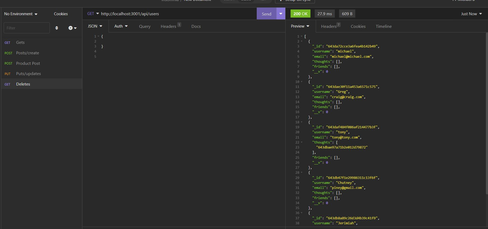
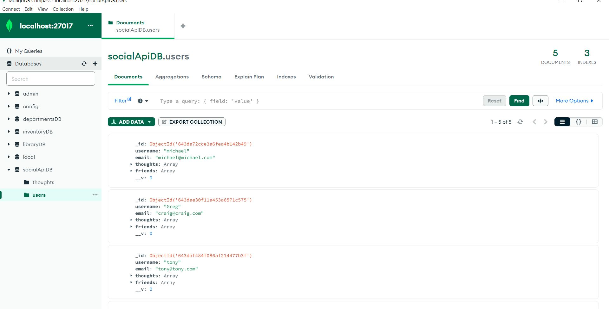
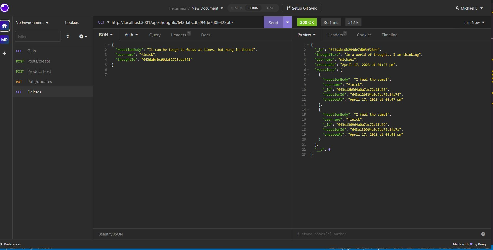
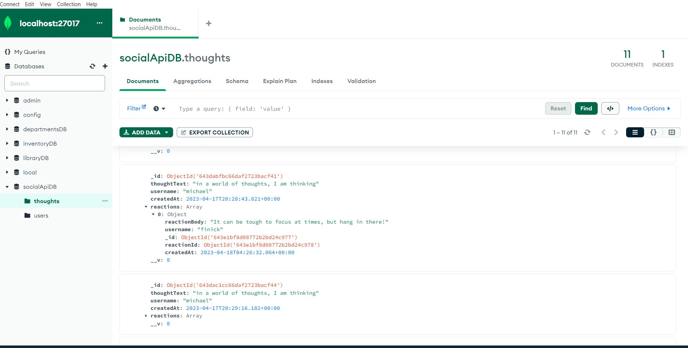
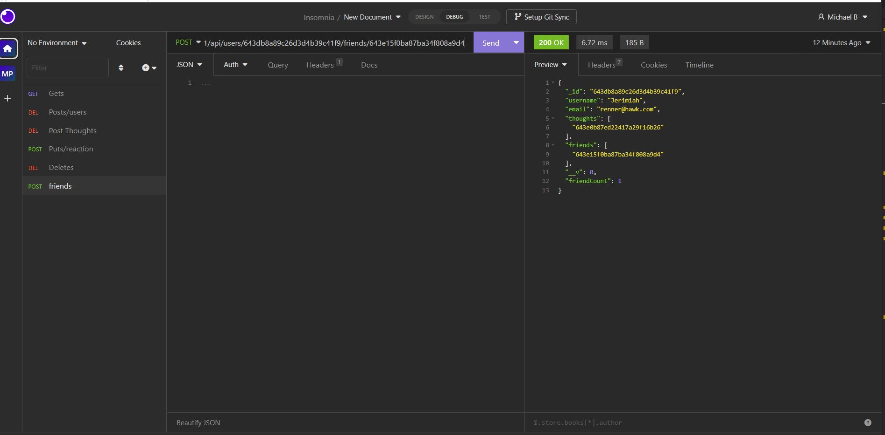

# Social Api Networks

## _Table Of Contents_

1. [Description](#description)
2. [Usage](#usage)
3. [Installation](#installation)
4. [License](#license)
5. [Criteria For Assignment](#criteria-for-assignment)
6. [Repo Link](#repository-link)
7. [Walkthrough Video](#walk-through-video)
8. [Screen Shots](#screen-shots)

## Description

For this assignment I was tasked with creating a an API for a social network application where the user would be able to comment their thoughts and react to other users thoughts. Using express.js and mongoose this application will be tested with insomnia to show that the posts are able to be made as well as the reactions. Within insomnia I am able to create, update, find and delete a user and thought. I am also able to test adding and deleting a reaction to a thought, as well as adding or deleting a friend to a specific user. This is also synced to my mongoose so the data base is updated as I am making changes. I used an npm called moment to help with formatting the date of the thoughts and reactions.

## Usage

The user will be able to comment their thoughts and then use reactions to reply to other users thoughts. The user will also be able to delete their thoughts and reactions allowing them to interact with the application. If the user wishes to create an account they will be able to do so and then update it as needed.

## Installation

You will need to install node packages including express.js, moment and mongoose.js after cloning the repo.

## License

MIT

_Website for license_

[MIT License Website](https://mit-license.org/)

## Criteria-for-assignment

GIVEN a social network API

**WHEN I enter the command to invoke the application**
*THEN my server is started and the Mongoose models are synced to the MongoDB database*

**WHEN I open API GET routes in Insomnia for users and thoughts**
*THEN the data for each of these routes is displayed in a formatted JSON*

**WHEN I test API POST, PUT, and DELETE routes in Insomnia**
*THEN I am able to successfully create, update, and delete users and thoughts in my database*

**WHEN I test API POST and DELETE routes in Insomnia**
*THEN I am able to successfully create and delete reactions to thoughts and add and remove friends to a user’s friend list*

## Repository-Link

[Github](https://github.com/PintoDrop/socialapi)

## Walk-Through-Video

[Walkthrough Video](https://drive.google.com/file/d/1u5qGg3e36XmpV2QBsiEOQsWphWCFCktL/view)

## Screen-Shots

